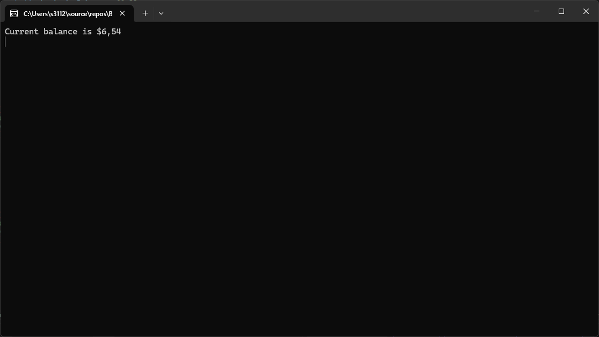
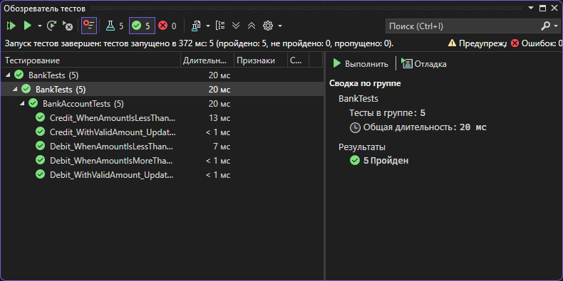
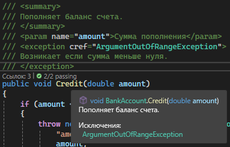

# Bank

# Практическая работа №6 — Создание автоматизированных unit-тестов

**Студент:** Солдатов А.С. Дудченко Р.А.  

**Группа:** 3ИСИП-123  

**Дата:** 2026-03-10

### Цель работы

Провести тестирование разработанных программных модулей с использованием средств автоматизации Microsoft Visual Studio методом «белого ящика».

---

# Результат работы программы

На скриншоте показан результат выполнения консольного приложения и текущий баланс счета.

---

# Результаты модульного тестирования

На изображении показано окно Test Explorer.  

Все тесты успешно выполнены.

---

# XML-документирование кода

На скриншоте показано использование XML-комментариев (`///`) для документирования методов.

---

# Вывод

В ходе работы был разработан консольный проект Bank и создан проект модульных тестов BankTests.  

Были реализованы автоматизированные тесты для методов Debit и Credit класса BankAccount.  

Тестирование позволило обнаружить и исправить ошибку в методе Debit, где сумма списания добавлялась к балансу вместо вычитания.  

После исправления ошибки все тесты успешно прошли.

